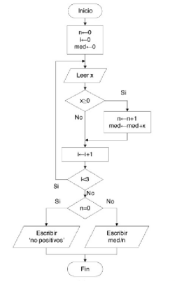
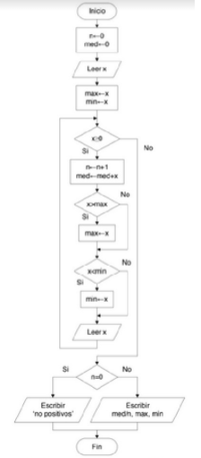
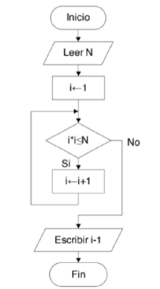
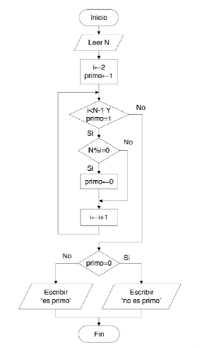
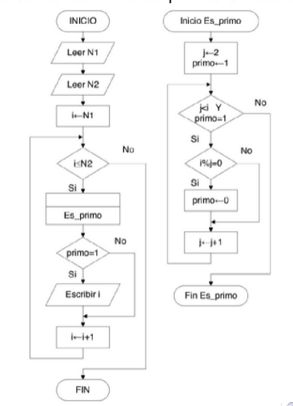

# Problemas de Programacion

Dentro de esta carpeta se encuentra el codigo de los problemas dejados en clase.

### Problema 1


Variables de entrada:
 - i numero de ingresos (control)
 - n numero de numeros positivos (control)
 - x valor del numero ingresado
 Variable de salida
 - media el resultado de la media aritmetica

Compilacion y ejecucion
```
 $ gcc -o Problema1.out Problema1.c
 $ ./Problema1.out 
```
### Problema 2

Variables de entrada:
 - n numero de numeros positivos (control)
 - x valor del numero ingresado 
 Variables de salida:
 - med variable de salida media de los numeros ingresados
 - max  maximo de los numeros ingresados
 - min minimo de los numeros ingresados

Compilacion y ejecucion
```
 $ gcc -o Ejercicio2.out Ejercicio2.c
 $ ./Ejercicio2.out 
```
### Problema 3

Variables de entrada:
 - N valor del numero ingresado 
 Variables de salida:
 - i-1 variable que regresa el valor de la raiz de N

Compilacion y ejecucion
```
 $ gcc -o Problema3.out Problema3.c
 $ ./Problema3.out 
```

### Problema 4

Variables de entrada:
 - N valor del numero ingresado 
 - primo variable que evalua si el numero es primo (control)
 - i (control) para operar y saber si es primo
 Variables de salida:
 - mensaje de "es primo"/"no es primo"

Compilacion y ejecucion
```
 $ gcc -o Problema4.out Problema4.c
 $ ./Problema4.out 
```

### Problema 5

Variables de entrada:
 - N1 valor del primer numero ingresado
 - N2 valor del segundo numero ingresado 
 - primo variable que evalua si el numero es primo (control)
 - j (control) para operar y saber si es primo
 Variables de salida:
 - i se muestra para cada valor primo

Compilacion y ejecucion
```
 $ gcc -o Problema5.out Problema5.c
 $ ./Problema5 .out 
```