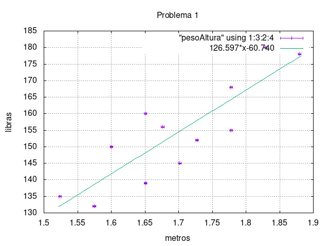

# Segundo parcial
## Problema 1
### Peso-Altura
**1. Enunciado**

Un grupo de estudiantes se sometieron a evaluaciones medicas, el doctor quiere estimar la relación entre peso y altura para cada estudiante, solo con la muestra de 12 estudiantes. (Archivo pesoAltura)
Le solicitan que genere un programa el cual cumpla con las siguientes condiciones:
 - Una grafica que compare los valores tabulados y la recta que mejor aproxima el crecimiento, de estatura en metros vs peso en libras.
 - Estime el peso de cualquier persona en base a su altura.

**2. Metodología**

Aplicando el método de minimos cuadrados podemos obtener la ecuacion de una recta que se ajuste de mejor forma a un grupo de datos.

$$ y=mx+b $$

$$m= \frac{n\sum_{k=1}^n{x_k y_k}- \sum_{k=1}^n{x_k}*\sum_{k=1}^n{y_k}}{n \sum_{k=1}^n{x_k^2}-(\sum_{k=1}^n{x_k})^2} $$

$$ b= \frac{\sum_{k=1}^n{y_k}-m\sum_{k=1}^n{x_k}}{n} $$

tomamos a $$\epsilon$$ como el error medido de x entonces:

$$ \Delta m= \frac{\sqrt{n}\epsilon}{\sqrt{n\sum_{k=1}^n{x_k^2}-(\sum_{k=1}^n{x_k})^2}} $$

$$ \Delta b= \frac{\epsilon}{\sqrt{n}} $$

Para la respuesta final se usa propagación de errores en la ecuación lineal.

**3. Variables**

Entrada
 - *altura[]* arreglo que guarda los valores de estatura del proceso experrimental
 - *peso[]* arreglo que guarda los valores de peso del proceso experimental
 - *n* número de elementos que contienen los arreglos
 - *erorx* error expperimental de las alturas
 - *errorm* varible que guarda el error de m
 - *errorb* varible que guarda el error de b
 - *m* varible que guarda el valor de m, pendiente de la recta del crecimiento
 - *r*  coeficiente de determinación por el metodo de minimos cuadrados
 - *estatura* variable que gurada la altura ingresada por el ususario

Salida
 - *pesoEst* varible que regresa el peso en función de la altura ingresada
 - *errpesoEst* error del calculo del peso estimado
 - texto de *Altura ingresada inválida*

**4. Diagrama de flujo**


**5. Solución**

Para encontrar la recta que describe el crecimiento se utilizó el método de minimos cuadrados, el programa nos devuelve la función del peso en base a la altura con su respectivo margen de error. En la siguiente grafica se encuentra la distribución de los datos experimentales y la recta que se ajusta al crecimiento.



Con la función ya obtenida el usuario puede ingresar una altura en metros y se estima el peso adecuado.

COMPILADO Y EJECUCION:

```
$ gcc -o pesoAltura.out pesoAltura.c -lm
$ ./pesoAltura.out
```

## Problema 2
### Newton Raphson:
**1. Enunciado:** 

Utilizando el método de Newton Raphson encontrar una raiz de la ecuación

$$ x^3-2x^2-3x+10 $$

Realizar la gráfica de la ecuación,  comparar el resultado con la respuesta del programa realizado en C.

**2. Metodología**
El método de Newton Raphson es un método numérico para encontrar aproximaciones a los ceros de una función.
Consiste en aplicar las siguintes ecuaciones:

$$ x_{i+1}= x_i-\frac{f(x_i)}{f'(x_i)} $$

Para este caso:

$$ x_{i+1}= x_i-\frac{x_i^3-2x_i^2-3x_i+10}{3x_i^2-4x_i-3}  $$

**3. Variables**

Entrada
 - *xi* variable en la que inicia el método
 - *iteracion* variable que lleva el número de veces que que se puede hacer el metodo para cada xi
 - *tolerancia* distancia o "pasos" entre cada iteración
 - *iteracionA* iteración anterior

Salida
 - *sol* variable que devuelve la solucion del problema
 - mensaje *No hay solucion despues de n iteraciones*

**4. Diagrama de flujo**


**5. Solución**

El problema se resolvió aplicando el método de Newton Raphson donde el valor aproximado de x puede encontrarse mediante la siguiente grafica de la función


En la gráfica se ve que la raiz es -2 y por ser un número exacto el programa nos devuelve ese número exacto. Por lo tanto el programa si encuentra la raiz de la función especificada en el enunciado.

COMPILADO Y EJECUCION:

```
$ gcc -o NewtonRaphson.out NewtonRaphson.c -lm
$ ./NewtonRaphson.out
```
    

